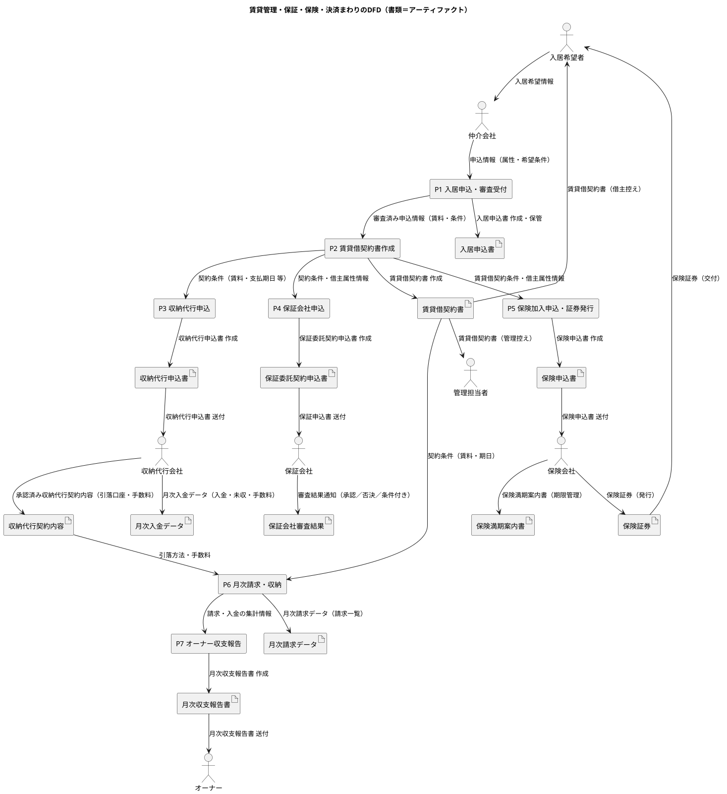

# 🏢 管理会社立ち上げ 概要メモ（前回 2025.10 中旬）

スコープ
設備は ⭕️
入居　パンフレット
立ち会いは外注
リフォームは論点外注前提、

再募集は巡回しているので、写真撮ったり改善できる。
入居者の保険は手間かも、オーナー向けを対象だが地震は取次手数料安い

保険会社選定は優先的に
代理店登録は、AIG、三井住友海上に、凸る
⭐️ 家賃保証は会社に確認、、保険商品の
カーサ、全保連、オリコ、複数はあったほうが良い。審査落ちる人を想定して複数ルートが望ましい場合がある。

アレップスに 3 ヶ月前退会通知が必要、4 月開始する場合

⭐️ ご近所ワークのアカウント、案件一覧から要
https://gokinjowork.jp/orderer/projects/processing/
ID・メール：ojima.h.0128@gmail.com
パスワード：Grancourt2025

# 使用資料

---

## 🎯 目的

- 管理・保険代理・更新業務を自社で内製化し、収益源を拡大する。
- 将来的に賃貸・売買仲介にも展開できる形をつくる。

---

## 🗓 想定スケジュール

- 隔週打ち合わせで半年間準備・設計
- **2026 年 7 月ごろまでに試験運用 → 本格展開**

---

## 🧭 想定業務範囲

- ホワイトオークキャピタル主体で以下の業務

- 退去立ち会い
- リフォーム・再募集
- 更新手続き・条件変更
- 保険代理店（火災・地震保険）
- 入居者向けサービス（駆けつけ、ネット取次など）
- 清掃管理（ご近所ワーク等）

---

## 🚀 ファーストステップ - 宿題事項

1. **ビザスク等でヒアリング**

   - 管理・保険・更新の実際の業務範囲と流れを洗い出す
   - **収益構造（どこで利益が出るか）** を把握する

   → 問い合わせしたところビザスクサービス内容が代わりチケット 100 万円が最低ライン。
   法人で登録料が必要。代替サービス

2. **スケジュールの検討**
   (別紙)
3. **保険募集人**
   - テキストは購入済み
   - 検討課題 001

## 前提の再確認

「管理業を事業化する」と「管理を自分でやる（委託せず節約）」は検討のプロセスが大きく異なる。前者は法人・システム・外注を含む“収益構造の設計”だが、後者は“管理会社を使わずに回すための実務ノウハウ”である。
なので、方向性としては自主管理を始める際の「作業・実務」中心のステップに整理する。

## 🏠 課題 000-賃貸管理を「自分でやる」場合の現実的アプローチ

---

### 🎯 要件

管理会社を使わず、自分で管理することでコストを抑え、役割重複感、スピード感の低下を防ぎたい。事業化や収益性ではなく「オーナーとして節約・実務を理解して回す」ことを目指す。

---

### 1️⃣ 管理業務の構成・スコープ検討

---

| フェーズ           | 区分                 | 主な内容                           | 具体的作業例                                                       | 自力で可能か | 必要な免許・資格                                         | 備考・補足                                                           |
| ------------------ | -------------------- | ---------------------------------- | ------------------------------------------------------------------ | ------------ | -------------------------------------------------------- | -------------------------------------------------------------------- |
| **① 募集・仲介**   | 入居者募集           | 募集条件設定・広告・内見対応       | ・家賃・条件の設定<br>・写真撮影・ポータル掲載<br>・内見・申込受付 | △            | 宅地建物取引業免許（自ら他人の物件を募集・媒介する場合） | 自己所有物件のみなら免許不要。SUUMO 等掲載には仲介会社経由が現実的。 |
|                    | 入居審査・契約       | 入居者の審査と契約書締結           | ・申込書確認・保証審査<br>・契約書作成・署名押印<br>・鍵引渡し     | ○            | 特になし（宅建士であれば望ましい）                       | 自主管理物件は資格不要。第三者物件契約は宅建業免許必要。             |
| **② 入居中管理**   | 家賃管理             | 家賃の請求・収納・滞納対応         | ・収納代行サービス契約<br>・入金チェック・督促<br>・送金処理       | ○            | 特になし（代行業務契約で可）                             | 家賃保証・代行を組み合わせると効率化できる。                         |
|                    | 修繕・設備対応       | 設備不良・漏水等の対応             | ・業者手配・見積比較<br>・修繕報告書確認                           | △            | 建設業許可（自社施工・請負時）                           | 軽微な修繕・発注は資格不要。請負受注は要建設業許可。                 |
|                    | 保険対応             | 損害・事故発生時の保険処理         | ・事故報告<br>・保険会社連絡<br>・修繕見積提出                     | ○            | 保険募集人資格（販売時）                                 | 保険契約の受付は資格必要。事故報告は誰でも可。                       |
|                    | 入居者サポート       | 駆けつけ・ライフライン・ネット取次 | ・電気・水道・ネット取次連携<br>・鍵トラブル対応                   | ○            | 特になし                                                 | 紹介・取次契約による収益化が可能。                                   |
|                    | 清掃・巡回           | 共用部清掃・点検                   | ・定期清掃手配<br>・巡回チェック<br>・記録保管                     | ○            | 特になし                                                 | 外注委託可。自社請負は軽微な業務なら免許不要。                       |
| **③ 更新**         | 契約更新             | 契約更新通知・条件変更             | ・更新通知書作成・発送<br>・新契約書締結<br>・賃料交渉             | ○            | 特になし                                                 | 自己所有物件は自由。代理・代行業務で報酬を得る場合は宅建免許要。     |
|                    | 火災保険更新         | 満期管理・更新案内                 | ・保険会社通知確認<br>・入居者へ案内                               | △            | 保険募集人資格＋代理店登録                               | 保険会社システムで自動通知可。                                       |
| **④ 退去**         | 解約受付             | 退去申請・解約書面処理             | ・解約届受理<br>・退去日調整<br>・鍵返却管理                       | ○            | 特になし                                                 | 契約書記載に基づき処理。                                             |
|                    | 退去立会い           | 室内確認・原状回復範囲判断         | ・損耗確認・写真記録<br>・敷金精算書作成                           | △            | 特になし（専門知識が望ましい）                           | ガイドライン理解が必要。外部業者同行が安全。                         |
|                    | 原状回復・リフォーム | 修繕・工事・美装                   | ・見積取得・施工手配・完了確認                                     | △            | 建設業許可（請負時）                                     | 発注のみなら不要。施工は条件により要許可。                           |
|                    | 再募集準備           | 写真撮影・広告作成                 | ・前回実績確認・条件見直し<br>・募集資料作成                       | ○            | 特になし（媒介しなければ不要）                           | 仲介会社へ募集依頼が一般的。                                         |
| **⑤ オーナー対応** | 収支報告             | 月次・年次収支報告書作成           | ・入金・支出集計<br>・報告書送付                                   | ○            | 特になし                                                 | freee などの会計ソフト活用可。                                       |
|                    | 税務・申告           | 確定申告対応                       | ・年間収支整理<br>・税理士提出                                     | ○            | 特になし（税理士に委託可）                               | 青色申告を選択すれば節税可。                                         |
| **⑥ 付帯事業**     | 保険代理店業務       | 火災・地震保険募集                 | ・パンフ配布・申込受付<br>・代理店システム登録                     | △            | 損害保険募集人資格＋代理店登録                           | 入居者保険募集が可能。                                               |
|                    | 取次・紹介サービス   | 光回線・駆けつけ・家電・引越し     | ・提携サービス紹介<br>・申込情報連携                               | ○            | 特になし                                                 | 紹介料・アフィリエイト収入化が可能。                                 |

---

### 🧩 関連免許・資格まとめ

| 免許・資格                     | 対象業務                       | 根拠・目的                                           |
| ------------------------------ | ------------------------------ | ---------------------------------------------------- |
| 宅地建物取引業免許             | 募集・仲介・媒介               | 他人の物件の仲介・契約代行を行う場合に必要。         |
| 建設業許可                     | リフォーム・原状回復           | 工事金額 500 万円超（建築一式 1,500 万円超）で必要。 |
| 損害保険募集人資格＋代理店登録 | 保険販売                       | 火災・地震保険の募集・契約受付に必要。               |
| 清掃業・便利業届出（自治体）   | 清掃・巡回                     | 地方条例によっては簡易届出が必要な場合あり。         |
| 特になし                       | 入居者取次・契約更新・収支管理 | 自己所有物件・事務管理業務は資格不要。               |

---

### 🧩 サポートツール例

| 分類                 | 推奨ツール                                          | 用途               |
| -------------------- | --------------------------------------------------- | ------------------ |
| 契約管理             | Google Drive / Notion                               | 書類・契約書の管理 |
| 家賃管理             | 住信 SBI 銀行 / オリコフォレントインシュア          | 自動入金・保証連携 |
| 会計処理             | freee / Money Forward                               | 収支整理・申告対応 |
| 修繕・清掃           | ご近所ワーク / ミツモア                             | 外注管理・価格比較 |
| 保険募集             | 損保ジャパン / AIG / 共栄火災                       | 代理店契約・募集   |
| コミュニケーション   | LINE 公式アカウント / Chatwork                      | 入居者連絡・記録化 |
| 統合型賃貸管理ソフト | [link](https://www.aspicjapan.org/asu/article/2277) | 要調査             |

### 🪜 大まかな流れ

| フェーズ                        | 目的                                         | 成果物（アウトプット）                                                               |
| ------------------------------- | -------------------------------------------- | ------------------------------------------------------------------------------------ |
| **Phase 1：現状整理・方針決定** | 現在の管理状況を把握し、自主管理範囲を決める | 管理方針、自主管理スコープ                                                           |
| **Phase 2：準備・基盤整備**     | 契約・収納・清掃などの実務基盤を構築         | 契約書テンプレ、収納代行契約、業者リスト、運用計画書(業務フロー、管理表一覧、管理表) |
| **Phase 3：運用開始・試験管理** | 実際に 1〜2 棟を自主管理運用                 | 管理表（記入版）、トラブル対応ログ                                                   |
| **Phase 4：改善・拡大検討**     | 問題点の見直し                               | 改善リスト、運用計画書更新版                                                         |

---

### 📋 概要 WBS・主要タスク（案・粗々）

・利用ツール調査／選定

| No      | タスク                     | 内容                                               |
| ------- | -------------------------- | -------------------------------------------------- | ------------------ | ----------------- |
| **1**   | 現状分析                   | 現在の管理会社との契約内容・手数料・業務範囲を把握 | 現状分析シート     | 1 週間            |
| **2**   | 自主管理範囲の決定         | どの業務を自分で行うか、外注するかを明確化         | 自主管理マトリクス | 1 週間            |
| **2.5** | 費用対効果シミュレーション | 削減効果                                           |
| **3**   | 書類・契約整備             | 賃貸借契約書・更新書類・解約書などの雛形を確保     | 契約書テンプレ集   | 2 週間            |
| **4**   | 収納代行／保証会社の選定   | 家賃収納・保証会社を選び契約                       | サービス契約書     | 2 週間            |
| **5**   | 修繕・清掃業者登録         | 緊急対応・定期清掃などの業者リスト化               | 外注先リスト       | 2 週間            |
| **6**   | 会計・収支管理体制構築     | 会計ソフト・スプレッドシート整備                   | 収支管理テンプレ   | 1 週間            |
| **7**   | 保険代理・火災保険運用整備 | 保険募集人資格取得・代理店登録                     | 保険運用フロー     | 1〜2 ヶ月（並行） |
| **8**   | 入居者連絡フロー構築       | LINE・メール・フォームなど窓口設定                 | 連絡テンプレート集 | 1 週間            |
| **9**   | 試験運用開始（1〜2 棟）    | 実際に自主管理を実施し、課題を記録                 | 運用ログ           | 3〜6 ヶ月         |
| **10**  | 定期点検・清掃             | 月 1 回〜2 回の巡回と報告記録                      | 清掃報告書         | 継続              |
| **11**  | トラブル対応ルール作成     | 苦情・修繕・夜間対応のルール化                     | 対応マニュアル     | 1 ヶ月            |
| **12**  | 月次収支まとめ             | 家賃入金・経費・修繕費を整理                       | 月次収支報告書     | 毎月              |
| **13**  | 更新管理                   | 契約満期・保険更新を自動管理                       | 更新スケジュール表 | 毎年              |
| **14**  | 定期見直し                 | 外注コスト・手間を評価し再委託を判断               | 改善レポート       | 半年ごと          |

### 🔍 優先順位・考え方

1. **リスクが大きい業務（契約・家賃）** → 仕組みを先に整える
2. **外注しやすい業務（清掃・修繕）** → 最初から委託前提で OK
3. **手数料削減効果が高い業務（家賃管理・更新）** → 自力化の中心に

---

### 📈 スケジュール

| 期間       | フェーズ     | 目標                                  |
| ---------- | ------------ | ------------------------------------- |
| 1〜3 ヶ月  | 準備・構築   | 書類・外注先・収納代行などの基盤整備  |
| 4〜6 ヶ月  | 試験運用     | 1〜2 棟で自主管理を試行、課題洗い出し |
| 7〜12 ヶ月 | 安定運用     | 契約・清掃・収支管理をルーチン化      |
| 1 年以降   | 拡張・自動化 | 保険募集・更新通知・クラウド連携導入  |

## 🧾 課題 00 １-保険募集人のはじめ方

---

## 🎯 要件

入居契約時に火災保険（家財・借家人賠償）を自分で案内・契約できるようにする。  
自分が「保険募集人」として登録し、正式に保険会社の商品を扱う。

---

### 1️⃣ 保険募集の基本構造

| 区分           | 役割                                     | 説明                             |
| -------------- | ---------------------------------------- | -------------------------------- |
| **保険会社**   | 三 海上・損保ジャパン・AIG・東京海上など | 保険商品を提供する企業           |
| **保険代理店** | あなた（個人 or 法人）                   | 保険会社と契約し、商品を扱う立場 |
| **保険募集人** | あなた自身 or 従業員                     | 実際に説明・申込受付を行う人     |

> ✅ 「募集人資格」＝試験に合格した人  
> ✅ 「代理店登録」＝保険会社と契約した事業体  
> → 両方揃って初めて合法的に販売できる。

---

### 2️⃣ 全体の流れ（最短で約 1〜2 ヶ月）

```text
STEP1：取扱いたい保険会社を決める
   ↓
STEP2：保険会社と代理店契約を申し込む
   ↓
STEP3：募集人資格（損保一般試験）を受験・合格
   ↓
STEP4：代理店登録完了 → 募集開始
```

## 🏠 課題 00 ２-自主管理オーナーが仲介業者経由で保険を案内する

---

### 🎯 要件

賃貸借契約時に入居者へ火災保険（家財＋借家人賠償）を案内したい。  
自分が保険募集人資格を持ち、保険会社の代理店として契約処理を行う。  
仲介業者には「資料配布」のみ協力してもらう。

---

### 1️⃣ 法的な整理

| 行為                                   | 資格が必要か          | 備考                   |
| -------------------------------------- | --------------------- | ---------------------- |
| 保険商品の説明（補償内容・保険料など） | ✅ 必要（保険募集人） | 保険業法第 275 条      |
| 申込書の記入・回収（正式申込）         | ✅ 必要               | 募集行為に該当         |
| 保険案内書の配布（パンフを渡すだけ）   | ❌ 不要               | 募集行為には当たらない |
| 「入居時に保険加入が必要」と伝える     | ❌ 不要               | 契約条件の説明として可 |

---

### 2️⃣ 運用フロー

**流れ：**

1. 自分が保険代理店登録を行い、募集人資格を取得する。
2. 仲介業者に「この物件は入居時に火災保険加入が必要」と伝える。
3. 仲介が入居申込者に **保険案内書（QR 付きパンフなど）** を渡す。
4. 入居者が直接 Web 申込。
5. あなたが代理店システム上で契約を処理。

**ポイント：**

- 仲介は「配布」のみ。
- 説明・申込はあなた（募集人）が行う。
- 仲介に紹介料などを支払うのは NG（資格がないため）。

---

以下は事業化における不動産賃貸管理の業務分析


